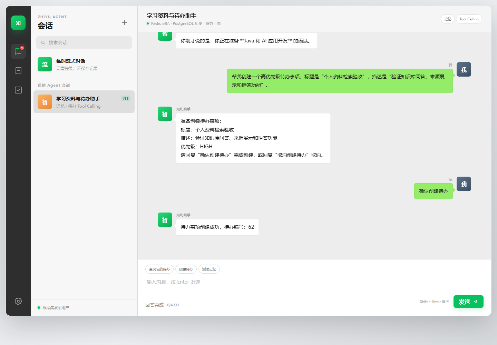
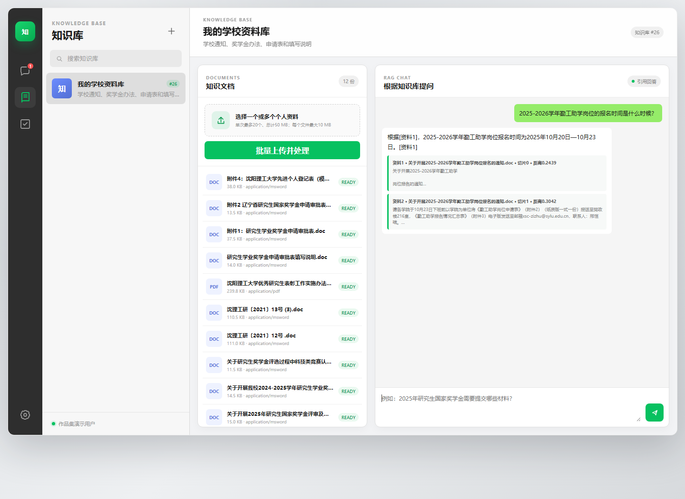
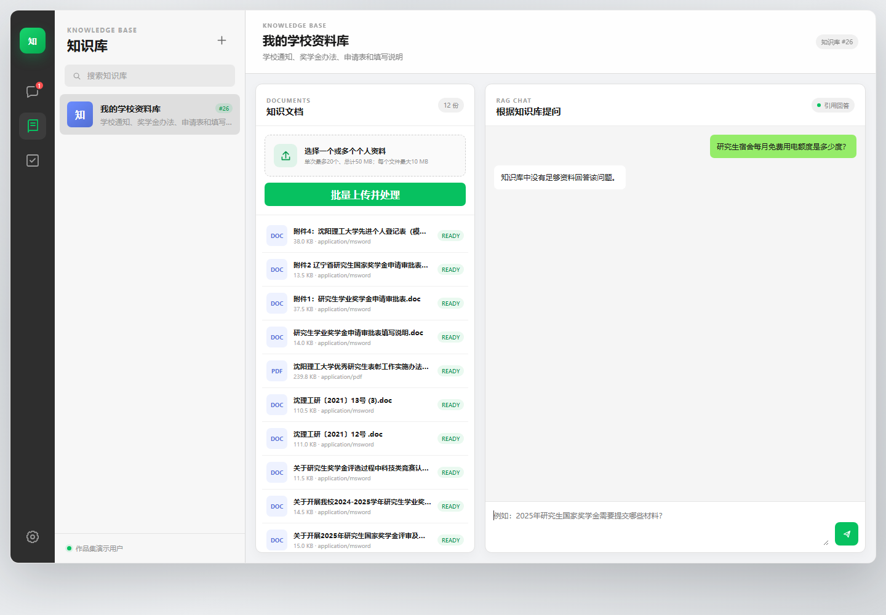
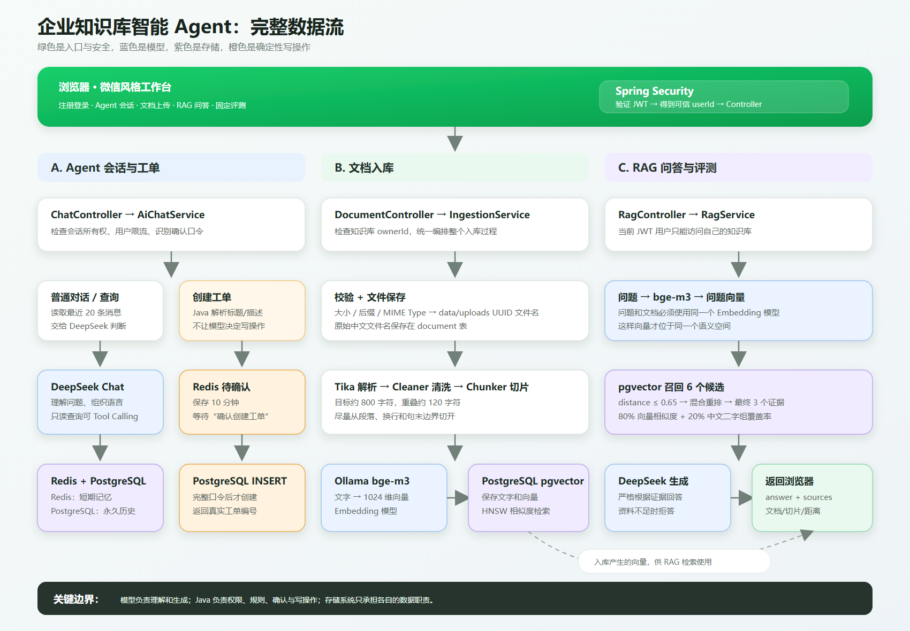

# 知屿 · 个人知识库助手

> 一个面向个人资料管理的 Java + AI 应用：上传 PDF、DOC、DOCX、TXT 或 Markdown 后，系统从用户自己的知识库检索证据，基于证据回答并展示来源；资料不足时明确拒答。

## 项目总览



## 这个项目做了什么

知屿把“资料入库、带来源问答、对话记忆和待办助手”放在同一个 Web 工作台中：

- **个人知识库**：创建知识库，单个或批量上传资料，查看文档处理状态。
- **RAG 问答**：使用 bge-m3 和 pgvector 找到相关切片，再由 DeepSeek 根据有效资料回答并展示来源。
- **Agent 会话**：PostgreSQL 保存完整聊天历史，Redis 缓存最近 20 条 message；缓存失效后从数据库回填。
- **待办事项**：Spring AI Tool Calling 只负责查询和统计；创建由 Java 解析意图，先写 Redis 临时草稿，用户完整确认后再写 PostgreSQL。
- **安全边界**：Spring Security + JWT 识别用户，所有知识库、会话和待办操作都校验资源所有权。

## 运行效果

以下图片来自当前项目的真实运行页面，使用演示账号和学校资料库数据，不包含 Token、密钥、数据库密码或个人联系方式。

### RAG 带来源回答

系统从已上传资料中检索证据，答案中的资料编号与下方来源卡片对应，并展示文档、切片和余弦距离。



### 资料不足拒答

当当前知识库没有通过余弦距离门控的证据时，系统直接返回资料不足，不把无关切片交给模型编造答案。



## 核心链路



### 1. 文档入库

```text
所有权校验
→ 文件大小、扩展名和真实 MIME 类型校验
→ 原文件以 UUID 文件名保存
→ Apache Tika 提取正文
→ 文本清洗与 800/120 重叠切片
→ 切片保存 PostgreSQL
→ Ollama bge-m3 生成 1024 维向量
→ 向量写入 pgvector
→ 文档状态变为 READY
```

### 2. RAG 在线问答

```text
bge-m3 生成问题向量
→ pgvector 按余弦距离检索当前知识库 READY 文档
→ 召回 Top 8
→ 保留 cosine distance ≤ 0.3496 的切片
→ 无合格证据：Java 直接拒答，不调用 DeepSeek
→ 有合格证据：组成带编号的资料上下文
→ DeepSeek 依据资料回答
→ 后端返回 answer + sources
```

检索结果保持 pgvector 的余弦距离升序，距离越小越相关。

### 3. Agent 会话与待办

只读待办查询允许模型通过 Tool Calling 选择工具，但可信 `userId` 由后端通过 `ToolContext` 注入，不能由模型或用户自然语言决定。

创建待办属于写操作，不直接暴露给模型：

```text
Java 解析标题、描述和优先级
→ Redis 保存 10 分钟待确认草稿
→ 页面展示解析结果
→ 用户输入完整口令“确认创建待办”
→ 后端重新校验 userId、sessionId 和草稿
→ PostgreSQL 正式写入
→ 删除 Redis 草稿
```

确认成功后才会生成正式待办编号。这样模型可以参与自然语言理解，但最终写操作仍由确定性的 Java 流程和用户本人控制。

## RAG 参数不是拍脑袋得到的

项目使用当前个人资料库进行了可复现的离线校准：

| 项目 | 当前事实 |
|---|---:|
| 真实资料 | 12 份 |
| 当前切片/向量 | 44 条 |
| 人工标注问题 | 48 条 |
| 校准集 | 32 条（24 有答案、8 无答案） |
| 隔离测试集 | 16 条（12 有答案、4 无答案） |
| 切片配置 | 800 字符，重叠 120 字符 |
| 在线检索 | Top 8，余弦距离阈值约 0.3496 |
| 测试集 Hit@8 | 11/12 = 91.67% |
| 回答/拒答门控判断 | 15/16 = 93.75% |
| 无答案题误接受 | 0/4 |

选参过程：先运行 17 组只改变切片参数的纯向量实验。`1800/65` 的第一名排序略好，但 `800/120` 在 Hit@3、Hit@8 相同的情况下让 Top8 上下文少约 46.7%，因此正式版保留 `800/120` 作为质量与成本折中。固定切片后，让 K 从 1 到 20 运行同一校准集，`K=8` 是第一次达到最高 Hit 平台的最小值；距离阈值优先约束校准集无答案题零误接受，再尽量放行有答案题。参数锁定后才在 16 条测试题上报告一次。

这些结果只代表当前语料、切片方式和 bge-m3，不是通用常数，也不是“最终回答准确率”。详细定义与原始选择规则见 [RAG 评测说明](docs/RAG_EVALUATION.md) 和 [参数证据](docs/PARAMETER_EVIDENCE.md)。

## 技术栈与选择原因

| 技术 | 在项目中的作用 | 选择原因 |
|---|---|---|
| Java 17 / Spring Boot | Web、业务编排、校验和安全边界 | 完整的 Java 后端工程体系 |
| Spring Security / JWT / BCrypt | 认证、密码哈希和可信用户身份 | 统一保护受限接口，避免把身份交给模型决定 |
| Spring AI | ChatClient、Tool Calling、模型适配 | 用统一抽象连接 DeepSeek 与 Ollama |
| Apache Tika | MIME 检测和正文提取 | 用一个入口处理多种文档格式 |
| Ollama / bge-m3 | 本地运行 Embedding，输出 1024 维向量 | 中文及长文本能力适合当前资料，模型可本地部署 |
| PostgreSQL / pgvector | 业务数据、历史消息、切片和向量检索 | 关系过滤与向量检索能在同一数据库完成 |
| Redis | 最近 20 条消息缓存、限流、待确认草稿 | 适合短期、可过期和高频访问的数据 |
| Flyway | 数据库结构版本管理 | 数据表变更可以随代码演进和复现 |
| Docker Compose | PostgreSQL、Redis、Ollama 和应用编排 | 降低本地运行成本，数据用 named volume 保留 |

## 工程设计边界

- 浏览器传入的知识库 ID、会话 ID 都不代表授权，Service 必须同时校验 JWT 用户和资源所有者。
- 模型只理解语言和选择只读工具；用户身份、写操作确认和数据库边界由 Java 控制。
- 完整聊天历史以 PostgreSQL 为事实源；Redis 缓存最近 20 条 message，缓存失效后从数据库回填。
- 文档与问题必须使用同一个 Embedding 模型；更换模型后必须重新生成全部向量。
- HNSW 索引已经创建，但当前只有 44 条向量，没有做性能 benchmark，因此不宣称具体提速倍数。
- 当前评测覆盖检索与回答/拒答门控，不把 Hit@8 包装成生成答案准确率。

## 本地运行

### 1. 准备配置

```powershell
Copy-Item .env.example .env
```

在 `.env` 中填写自己的 `DEEPSEEK_API_KEY`、数据库密码和至少 32 字节的 `JWT_SECRET`。`.env` 已被 Git 忽略，不要把真实密钥写入代码、截图或提交记录。

### 2. Docker Compose 启动

```powershell
docker compose --profile application up -d --build
docker compose exec ollama ollama pull bge-m3
```

- 工作台：<http://localhost:8080>
- 健康检查：<http://localhost:8080/actuator/health>

如果只想启动 PostgreSQL、Redis 和 Ollama，再从 VS Code 运行 Java：

```powershell
docker compose up -d
```

然后打开 `src/main/java/com/yan/agent/ZhiyuAgentApplication.java`，点击 `Run`。

### 3. 运行测试

```powershell
.\mvnw.cmd test
```

也可以使用 VS Code Testing 面板的 `Run Tests`。

## 主要 API

| 方法 | 路径 | 作用 |
|---|---|---|
| POST | `/api/v1/auth/register` | 注册并返回 JWT |
| POST | `/api/v1/auth/login` | 登录并返回 JWT |
| GET / POST | `/api/v1/chat/sessions` | 查询或创建会话 |
| POST | `/api/v1/chat/sessions/{sessionId}` | 带近期记忆和待办能力的 Agent 会话 |
| GET / POST | `/api/v1/knowledge-bases` | 查询或创建知识库 |
| POST | `/api/v1/knowledge-bases/{id}/documents/batch` | 批量上传并处理文档 |
| POST | `/api/v1/knowledge-bases/{id}/rag/ask` | 带来源的 RAG 问答 |
| POST | `/api/v1/knowledge-bases/{id}/evaluations/calibration` | 校准参数并评测检索与门控 |

更多实现细节见 [架构说明](docs/ARCHITECTURE.md)，可视化操作步骤见 [演示指南](docs/DEMO_GUIDE.md)。
